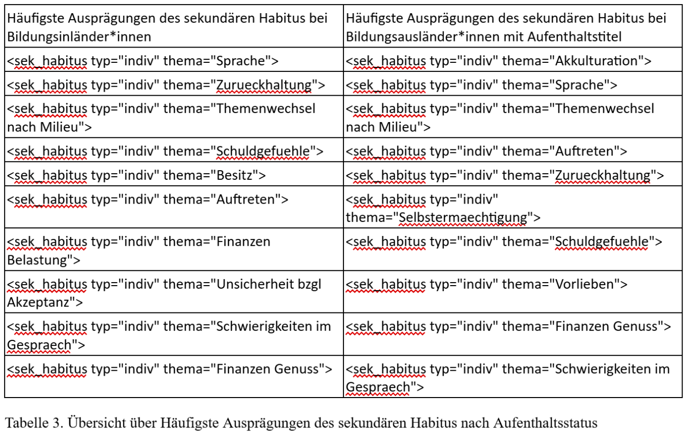

# (Gespaltener) Habitus internationaler Bildungsaufsteiger\*innen aus Nicht-EU-Ländern im Vergleich zu weiteren bildungsbenachteiligten Student\*innengruppen in Deutschland. Ausprägungen, Differenzen, Lösungen

Internationale Student\*innen aus Nicht-EU-Ländern machen rund 15 % der gesamten Student\*innenschaft an deutschen Hochschulen aus (Kroher et al. 2023, S. 32). Die Mehrheit verbleibt nach dem Studium langfristig in Deutschland (DAAD & DZHW 2024, S. 51). Etwa 80 % der internationalen Absolvent\*innen deutscher Hochschulen nehmen nach dem Studium eine Vollzeit-, Teilzeit- oder selbstständige Tätigkeit auf (Bruder et al. 2015, S. 10). Rund ein Drittel verfügt über ein Aufenthaltsrecht zu Erwerbszwecken (Statistisches Bundesamt 2022, S. 6). Internationale Student\*innen gelten daher als ein wichtiger Faktor zur Deckung des Fachkräftemangels in Deutschland (Hoffmeyer-Zlotnik & Grote 2018, S. 70). Das Studium an einer deutschen Hochschule wird seitens des deutschen Staates gezielt als Strategie eingesetzt, um hochqualifizierte Fachkräfte zu gewinnen und im Land zu halten (Schittenhelm & Schäfer 2024, S. 533).
Gleichzeitig sehen viele internationale Student\*innen das Studium in Deutschland als Chance, eigene Lebensqualität zu verbessern und sozial aufzusteigen. Neben politischen, humanitären, wirtschaftlichen und demografischen Situationen in ihren Herkunftsländern (DAAD & DZHW 2024, S. 41) nennen sie als Gründe für diese Bildungsentscheidung auch die hohe Lebensqualität, die stabile Wirtschaft, das entwickelte Bildungssystem sowie die Aussicht auf bessere berufliche Perspektiven (ebd., S. 52 f.).
Trotz der statistischen Relevanz dieser Gruppe bleibt sie in der wissenschaftlichen Forschung weitgehend unterrepräsentiert oder wird nur am Rande thematisiert (Ebert & Heublein 2017, S. 2). In amtlichen Statistiken werden internationale Student\*innen oft nicht separat ausgewiesen, sondern häufig unter der Kategorie „Student\*innen mit Migrationshintergrund“ subsumiert. Während Student\*innen mit Migrationshintergrund in der Bildungsungleichheitsforschung zunehmend berücksichtigt werden, bleiben die spezifischen Herausforderungen internationaler Student\*innen oftmals unbeachtet (Falk et al. 2022, S. 14). 
Ziel dieses Projektes ist es, zur Schließung dieser Forschungslücke beizutragen und explorativ zu untersuchen, wie sich der gespaltene Habitus in dieser Gruppe im Vergleich zu anderen Gruppen von Student\*innen, die ebenfalls von Bildungsbenachteiligung betroffen sind (etwa Student\*innen aus nicht-akademischen Elternhäusern oder Student\*innen aus armutsbetroffenen Familien), äußert und welche Strategien sie zur Bewältigung entwickeln. Es wird nach Korrelationen zwischen den Merkmalen, die sich auf die Herkunft der Student\*innen beziehen, und den konkreten Ausprägungen des gespaltenen Habitus gesucht.

## Forschungsfrage
1) Erleben Student\*innen aus Nicht-EU-Ländern mit einem Aufenthaltstitel nach § 16b AufenthG spezifische Formen eines ggf. gespaltenen Habitus im Vergleich zu anderen bildungsbenachteiligten Gruppen der Student\*innen? Wenn ja, wie genau äußert sich dieser?
2) Welche konkreten Hilfestellungen und Unterstützungsangebote sind förderlich im Umgang mit der Anpassung an das neue soziale Umfeld und der Transformation des Habitus? 

## Datnerhebung
Für diese Arbeit wurden Daten mittels einer Online-Umfrage erhoben. Die Umfrage bestand aus drei Teilen. Im ersten Teil wurden soziodemografische Merkmale erhoben. Dies waren_ 
- Staatsangehörigkeit (deutsch, EU, Nicht-EU)
- Migrationshintergrund, den Aufenthaltstitel (ja/nein, ggf. mit Angabe des Paragraphen nach AufenthG)
- Erwerb der deutschen Sprache (Muttersprache oder nicht, Alter und Ort des Spracherwerbs)
- Bildungsstatus der Eltern
- finanzielle Situation im Elternhaus (indirekt über eine Einschätzung, wofür das Geld reichte)
- Hochschultyp (Universität oder Hochschule; staatlich, privat oder kirchlich) 
- studierte Fachrichtung. 
Der zweite Block bestand aus offenen Fragen zur Wahrnehmung und Ausprägung des gespaltenen Habitus. Er war in fünf thematische Abschnitte gegliedert, die jeweils mehrere Fragen enthielten. Zunächst wurde nach der subjektiven Wahrnehmung des Übergangs in das neue soziale Umfeld gefragt sowie nach Unterschieden zum Herkunftsmilieu. Im Anschluss daran ging es um individuelle Anpassungsstrategien an das akademische Milieu. Weitere Fragen thematisierten beobachtete Unterschiede im Verhalten, Denken, in der Körpersprache und Ausdrucksweise in Interaktionen mit Menschen aus dem Herkunfts- bzw. Aufstiegsmilieu. Danach wurde erhoben, in welchem Milieu sich die Teilnehmer\*innen heimisch fühlen und in welchen Situationen sie den gespaltenen Habitus besonders stark wahrnehmen. Abschließend wurden Einschätzungen dazu erfragt, ob die Teilnehmer\*innen ihre Persönlichkeit nach dem Bildungsaufstieg als stimmig oder eher widersprüchlich erleben und inwiefern. 
Im dritten, abschließenden Block wurden Fragen zu Unterstützungsangeboten gestellt: Welche konkreten Hilfsangebote die Teilnehmer\*innen genutzt haben oder sich wünschen würden, die ihnen geholfen hätten, den Alltag zwischen verschiedenen sozialen Welten und ggf. verschiedenen Kulturen zu bewältigen, sich schneller anzupassen oder potentielle innere Widersprüche zu hemmen. Auch hier sollten die Teilnehmer\*innen begründen, warum eine bestimmte Maßnahme hilfreich war oder hilfreich sein könnte.

Die gesamten durch diese Umfrage gewonnenen Antworten (N=115) dürfen aufgrund von Datenschutzbestimmungen jedoch nicht veröffentlicht werden. Damit der Code aber trotzdem reproduzierbar bleibt, wurde eine Datei erstellt, die Antworten von Personen (N=9) enthält, die explizit zugestimmt haben, dass ihre Antworten auf GitHub veröffentlicht werden.

## Annotation der Antworten in XML

Alle Antworten wurden manuell im XML annotiert, angelehnt an das Kodieren in der qualitativen Inhaltsanalyse. Folgende Tags wurden eingesetzt:
- <prim_habitus typ=n thema=m> 
n ∈ {"indiv", "gruppe"}
m ∈ {Bildung", "Finanzen", "Besitz", "Lebensbedingungen", "Umgang mit Gegenstaenden", "Sprache", "Ostdeutschland", "Auftreten"}
- <sek_habitus typ=n thema=m>
n ∈ {"indiv", "gruppe"}
m ∈ {"Genuegsamkeit", "Sprache", "Auftreten", "Zurueckhaltung", "akademische Praegung", "Selbstermaechtigung", "Schwierigkeiten im Gespraech", "Themenwechsel nach Milieu", "Neid", "Unsicherheit bzgl Akzeptanz", "Akkulturation", "Schuldgefuehle", "Privileg-Bewusstsein","Besitz", "Vorlieben", "Klassenscham", "Finanzen Belastung", "Finanzen Genuss"}
- <nicht_passung bezogen_auf=n differenz=m thema=l>
n ∈ {"Herkunftsm", "Aufstiegsm"}
m ∈ {"nach Fach", "nach Bildungseinichtung"}
l ∈ {"Finanzen",  "Bildung", "fehlende Zugehoerigkeit", "Urlaub", "Aspirationen", "Lebenserfahrung","Besitz", "administr Ablaeufe",  "Sprache", "Wohnsituation", "bewegende Themen",  "Vorlieben","Beziehungen", "Frauenbilder",  "Auftreten", "Verstaendnis zur aktuellen Lebensweise"} 
- <habitus_beibehalten auspraegung=n>
n ∈ {"Authentizitaet", "Hysteresis-Effekt", "Umgebung mit vergleichbarem Werdegang"}
- <habitus_nach_aufstieg typ=n zugehoerigkeit=m>
n ∈ {"gesp", "flex"}
m ∈ {"keine", "beide Milieus", "Umgebung mit vergleichbarem Werdegang", "eher Aufstiegsm", "eher Herkunftsm"}
- <entfremdung typ=n>
n ∈ {"keine", "ambiv", "vollst", "subj"}

## Feature-Extraktion

Es wurden auf der Basis der Antworten folgende Features extrahiert:
- Topic-Modelling-Verfahren mittels LDA aus Gensim (2011) 
- BERTopic (2022) im gesamten Text einer Antwort
- Sentiment-Analyse mittels EmoLex (2013) 
- Sentiment-Analyse mittels germansentiment (2020)
- Top-20 N-Gramme (N=1;4) und ihre skalierte Frequenz
- Top-20 N-Gramme (N=1;4) und ihr TF-IDF
- Top-50 Wörter jeder Antwortsequenz mit dem höchsten Informationsgewinn und ihre skalierte Frequenz
skalierte Frequenz jedes Annotationstags pro Antwort
- TF-IDF jedes Annotationstags pro Antwort
- skalierte Frequenz und TF-IDF jedes Annotationstags der Gruppe <nicht_passung>
- skalierte Frequenz und TF-IDF jedes für Annotationstags der Gruppe <sek_habitus>

## Klassifizierung

Die Features wurden mittels Folgenden Klassifikatoren den erhobenen soziodemografischen Merkmalen zugeordnet: Support Vector Classifier, Logistic Regression, Random Forest, BERT, CatBoost.
Es hat sichgezeigt, dass baumbasierte Klassifikatiren eine bessere Performanz liefern. CatBoost ist für unbalancierte Daten besonders gut geeignet.

## Ergebnisse

Es zeigten sich deutliche Unterschiede in der habituellen Anpassung zwischen internationalen Student\*innen aus Nicht-EU-Ländern und deutschen bzw. europäischen Student\*innen. Staatsangehörigkeit (Abb. 1-5) und Aufenthaltsstatus (Abb. 6-8) erwiesen sich hierbei als die signifikantesten Prädiktoren für derartige Unterschiede. Diese beiden Merkmale überschneiden sich häufig, da rechtliche Regelungen zum Aufenthaltsstatus in der Regel an die Staatsangehörigkeit gekoppelt sind. Konkret bedeutet dies, dass Deutsche und EU-Bürger\*innen keinen Aufenthaltstitel benötigen, während Nicht-EU-Bürger\*innen und Staatenlose nur mit einem entsprechenden Aufenthaltstitel in Deutschland studieren dürfen. In den meisten Fällen handelt es sich bei letzteren um internationale Student\*innen, die gleichzeitig Bildungsausländer\*innen sind.

Darüber hinaus konnten Gruppen identifiziert werden, die besonders für die entsprechende Gruppe charakteristische Merkmale aufweisen und daher nahezu fehlerfrei klassifiziert werden können. Dazu gehören Teilnehmer\*innen, deren beide Eltern keinen Hochschulabschluss besitzen, Teilnehmer\*innen, die allein nach Deutschland eingereist sind, sowie Teilnehmer\*innen, die Deutsch als Fremdsprache im jungen Alter außerhalb Deutschlands gelernt haben. Im Falle beider letzten Gruppen handelt es sich überwiegend ebenfalls um internationale Student\*innen.

Bildungsaufsteigende internationale Student\*innen sind einer dreifachen Belastung ausgesetzt: Neben der Erbringung akademischer Leistungen und der sozialen Anpassung an das Aufstiegsmilieu – Herausforderungen, die auch für deutsche Bildungsaufsteiger\*innen relevant sind – müssen sie zusätzlich einen umfassenden Akkulturationsprozess bewältigen. Dies geht aus einer näheren Betrachtung der aussagekräftigsten Features hervor: der Inhalte des XML-Tags <sek_habitus> sowie der Wörter mit dem höchsten Informationsgewinn (Tab. 1-3).

Ferner wurde festgestellt, dass internationale Student\*innen (Tab. 4) sowie Student\*innen mit zugewanderten Eltern (Tab. 5) häufiger einen flexiblen Habitus aufweisen, was ihnen hilft, ein Gefühl von Zugehörigkeit zum Aufstiegsmilieu zu entwickeln. Diese Habitusflexibilität korreliert positiv mit Mehrsprachigkeit (Tab. 6) und Migrationserfahrung (Tab. 5) der Student\*innen.

Als zentrale Unterstützungsmaßnahme äußerten alle befragten Gruppen den Wunsch nach einer gezielten Vernetzung mit anderen bildungsaufsteigenden Student\*innen aus ähnlichen Herkunftsmilieus. Selbsthilfegruppen stellen dabei die beliebteste Form dieser Begegnung dar, gefolgt von Betreuung seitens fortgeschrittener Student\*innen aus ähnlichen Verhältnissen. Darüber hinaus wurde in einigen Forschungen zu Hilfestellungen bereits verdeutlichter Bedarf an spezifischen Unterstützungsangeboten für internationale Student\*innen bestätigt. Insbesondere lässt sich dieser im Bereich der Akkulturation verorten und betrifft die sprachliche Förderung sowie die Vermittlung von Wissen über die akademische Kultur in Deutschland. Auch eine intensivere Unterstützung bei der Integration in den deutschen Arbeitsmarkt wurde als notwendig identifiziert.

Auf methodischer Ebene erwies sich die in dieser Arbeit erprobte und bislang selten genutzte Kombination einer manuellen, an die qualitative Inhaltsanalyse angelehnten Annotation mit maschineller Klassifizierung als vielversprechend. Die Nutzung von XML-Tags und deren Attributen als Klassifizierungsgrundlage führte zu besseren Ergebnissen als maschinell erzeugte Features. 

## Inhalt

- Projektbeschreibng
- Lizenz (CC-BY-SA) s. hier: https://creativecommons.org/licenses/by-sa/4.0/deed.de
- Umfragedaten, dargestellt als Antworten von 9 Personen, die explizit einer Veöffentlichung auf GitHub zugestimmt haben ("umfragedaten_gefiltert.csv")
- Skript für die visuelle Darsellung der Stichprobenbeschreibung ("visualisierung_stichprobenbeschreibung.py", resultierende Datei "tabelle1_tokens_nach_merkmalen.xlsx")
- Aufbereitung der Umfragedaten als XML-Datei ("datenaufbereitung.py", resultierende Datei "umfrage_gelabelt.xml")
- Annotierte Umfeagedaten ("umfrage_gelabelt_annotiert.xml")
- Übersicht der Annotation ("annotation_uebersicht.py")
- Feature-Extraktion mit zuvor erfolgter Lemmatisierung ("lemmatisierung.py", "feature_extraktion.py", resultierende Dateien "umfrage_lemm.csv", "umfrage_featured.csv")
- Skripte für Klassifizierung und Visualisierung der Klassifizierungsergebnisse ("klassifikator_svm.py", "klassifikator_lr.py", "klassifikator_rf.py", "klassifikator_bert.py", "klassifikator_cb.py", resultierende Dateien "SVM_Ergebnisse.txt", "LR_Ergebnisse.txt", "RF_Ergebnisse.txt", "BERT_Ergebnisse.txt", "CB_Ergebnisse.txt")
- Übersicht über Hilfestellungen ("visualisierung_hilfestellungen.py", resultierende Datei "hilfestellungen_uebersicht.xlsx")
- Übersicht über Habitus nach dem Bildungsaufstieg der Teilnehmer\*innen und ihrer Entfremdung nach soziodemografischen Merkmalen ("habitus_entfremdung_counts.py", resultierende Datei "habitus_entfremdung_counts.py")

## Zitierempfehlung

Arazyan, N. (2025). Habitus internationaler Bildungsaufsteiger\*innen aus Nicht-EU-Ländern im Vergleich zu weiteren bildungsbenachteiligten Student\*innengruppen in Deutschland. Ausprägungen, Differenzen, Lösungen. GitHub-Repositorium zum Projekt. https://github.com/nunearazyan/internationale-studierende-bildungsaufstieg-habitus-hilfe

## Kleiner Literaturauswahl

- Apolinarski, B. & Brandt, T. (2018). Ausländische Studierende in Deutschland 2016. Ergebnisse der Befragung bildungsausländischer Studierender im Rahmen der 21. Sozialerhebung des Deutschen Studentenwerks durchgeführt vom Deutschen Zentrum für Hochschul- und Wissenschaftsforschung. Berlin: Bundesministerium für Bildung und Forschung (BMBF).
- Arazyan, N. (2025, Januar). Angepasst, Gespalten, Entfremdet. Einfluss eines sozialen Aufstiegs durch universitäre Bildung auf habituelle Praxisformen von Bildungsuafsteiger\*innen [Vortrag]. 12. GEBF-Kongress der Gesellschaft für Empirische Bildungsforschung, Mannheim. Abstact in GEBF2025-Abstractband (S. 103-104). https://www.sowi.uni-mannheim.de/media/Einrichtungen/gebf2025/GEBF2025_Abstractband.pdf/flipbook (abgerufen 30.06.2025)
- Arends-Tóth, J. & van de Vijver, F. J. (2007). Acculturation attitudes: A comparison of measurement methods. Journal of Applied Social Psychology, 37(7), 1462–1488. https://doi.org/10.1111/j.1559-1816.2007.00222.x
- Bourdieu, P. (1987). Sozialer Sinn. Frankfurt a. M.: Suhrkamp.
- Bourdieu, P. (2013): Die feinen Unterschiede. Kritik der gesellschaftlichen Urteilskraft (23. Aufl.). Frankfurt a. M.: Suhrkamp.
- Bourdieu, P. & Passeron, J.-C. (1971). Die Illusion der Chancengleichheit. Untersuchungen zur Soziologie des Bildungswesens am Beispiel Frankreichs. Stuttgart: Klett.
- Bourdieu, P. (2002). Ein soziologischer Selbstversuch. Frankfurt a. M.: Suhrkamp.
- Bourhis, R. Y.; Moïse, L. C.; Perreault, S. & Senécal, S. (1997). Towards an interactive acculturation model: A social psychological approach. International Journal of Psychology, 6(32), 369–386.  https://doi.org/10.1080/002075997400629
- Bruder, M.; Burkhart, S. & Wiktorin, C. (2015). Verbleib ausländischer Studierender und Absolventen in Deutschland. DAAD-Blickpunkt | Oktober 2015. Bonn: Deutscher Akademischer Austauschdienst e. V. (DAAD). https://static.daad.de/media/daad_de/pdfs_nicht_barrierefrei/der-daad/analysen-studien/verbleib_ausl%C3%A4ndischer_studierender_und_absolventen_in_deutschland_blickpunkt.pdf (abgerufen 20.05.2025)
- Deutscher Akademischer Austauschdienst e. V. (DAAD) & Deutsches Zentrum für Hochschul- und Wissenschaftsforschung GmbH (DZHW) (2024). Wissenschaft weltoffen 2024. Facts and figures on the international nature of studies and research in Germany and worldwide. Bielefeld: wbv Publikation. https://doi.org/10.25656/01:32744
- Ebert, J. & Heublein, U. (2017). Studienabbruch bei Studierenden mit Migrationshintergrund. Eine vergleichende Untersuchung der Ursachen und Motive des Studienabbruchs bei Studierenden mit und ohne Migrationshintergrund auf Basis der Befragung der Exmatrikulierten des Sommersemesters 2014. Hannover: Deutsches Zentrum für Hochschul- und Wissenschaftsforschung GmbH (DZHW).
- El-Mafaalani, A. (2012). BildungsaufsteigerInnen aus benachteiligten Milieus. Habitustransformation und soziale Mobilität bei Einheimischen und Türkeistämmigen. Wiesbaden: Springer VS.
- El-Mafaalani, A. (2014). Vom Arbeiterkind zum Akademiker. Über die Mühen des Aufstiegs durch Bildung. Sankt Augustin; Berlin: Konrad-Adenauer-Stiftung e. V.
- El-Mafaalani, A. (2017). Sphärendiskrepanz und Erwartungsdilemma. Migrationsspezifische Ambivalenzen sozialer Mobilität. Zeitschrift für Pädagogik 63(6): 708–725.
- Eribon, D. (2016). Rückkehr nach Reims. Berlin: Suhrkamp. 
- Falk, S., Kercher, J. & Zimmermann, J. (2022). Internationale Studierende in Deutschland: Ein Überblick zu Studiensituation, spezifischen Problemlagen und Studienerfolg. Beiträge zur Hochschulforschung, 44(2), 14–39.
- Fürtjes, O. & Arslan, E. (2016). Soziale Herkunft, Habitus und Zukunftsvorstellungen von Studierenden mit Migrationshintergrund. In E. Arslan & K. Bozay (Hg.), Symbolische Ordnung und Bildungsungleichheit in der Migrationsgesellschaft (S. 171–198). Wiesbaden: Springer VS.
- Hoffmeyer-Zlotnik, P. & Grote, J. (2018). Anwerbung und Bindung von internationalen Studierenden in Deutschland. Studie der deutschen nationalen Kontaktstelle für das Europäische Migrationsnetzwerk (EMN), Working Paper 85. Nürnberg: Bundesamt für Migration und Flüchtlinge (BAMF).
- Jindal-Snape, D. & Ingram, R. (2013). Understanding and supporting triple transitions of international doctoral students. ELT and SuReCom models. Journal of Perspectives in Applied Academic Practice, 1(1), 17–24. https://doi.org/10.14297/jpaap.v1i1.39
- Kroher, M., Beuße, M., Isleib, S., Becker, K., Ehrhardt, M. C., Gerdes, F., Koopmann, J., Schommer, T., Schwabe, U., Steinkühler, J., Völk, D., Peter, F., & Buchholz, S. (2023). Die Studierendenbefragung in Deutschland: 22. Sozialerhebung: Die wirtschaftliche und soziale Lage der Studierenden in Deutschland 2021. Hannover: Leibniz Universität Hannover. https://doi.org/10.15488/15772
- Möller, C. (2025). Sozialer Aufstieg und Scham Kompensations‐ und Bewältigungsmuster von Klassenscham am Beispiel von Professor\*innen statusniedriger Herkunftsgruppen. In C. Möller; F. Blome & J. Reuter (Hg.), Sozialer Aufstieg durch Bildung? Theoretische Zugänge, empirische Einsichten. Weinheim; Basel: Beltz Juventa. https://doi.org/10.25656/01:32269
- Möller, C., Blome, F. & Reuter, J. (Hg.) (2025): Sozialer Aufstieg durch Bildung? Theoretische Zugänge, empirische Einsichten. Weinheim; Basel: Beltz Juventa. https://doi.org/10.25656/01:32269
- Möller, C., Gamper, M., Reuter, J. & Blome, F. (2020). Vom Arbeiterkind zur Professur. Gesellschaftliche Relevanz, empirische Befunde und die Bedeutung biographischer Reflexionen. In J. Reuter, M. Gamper, C. Möller & F. Blome (Hg.), Vom Arbeiterkind zum Professor. Soziale Aufstiege in der Wissenschaft. Autobiographische Notizen und soziobiographische Analysen. Reihe Gesellschaft der Unterschiede (S. 9-63). Bielefeld: transcript Verlag.
- Morris-Lange, S. (2017). Allein durch den Hochschuldschungel: Hürden zum Studienerfolg für internationale Studierende und Studierende mit Migrationshintergrund. (Studie des SVR-Forschungsbereichs 2017-2). Berlin: Sachverständigenrat deutscher Stiftungen für Integration und Migration (SVR). https://www.svr-migration.de/publikationen/hochschuldschungel
- Neuenschwander, M, Hänni, S.; Makarova, E. & Kaqinari, T. (2022). Hindernisse und Ressourcen eines Bildungsaufstiegs - Eine qualitative Studie mit jungen Erwachsenen mit tiefem sozioökonomischem Status und/oder Migrationshintergrund. Schweizerische Zeitschrift für Bildungswissenschaften, 44(2), 209–222. https://doi.org/10.24452/sjer.44.2.4
- Pineda, J. (2018). Problemlagen und Herausforderungen internationaler Studierender in Deutschland. Ergebnisse einer qualitativen Vorstudie im Rahmen des SeSaBa Projekts (DAAD Studien). Bonn: Deutscher Akademischer Austauschdienst e. V. (DAAD). https://static.daad.de/media/daad_de/pdfs_nicht_barrierefrei/der-daad/analysen-studien/veroeffentlichungen_vorstudie_pineda_2018.pdf (abgerufen 20.05.2025)
- Pineda, J., Kercher, J., Falk, S., Thies, T., Yildirim, H. H. & Zimmermann, J. (2019). Studienfinanzierung: eine Hürde für internationale Studierende in Deutschland? Qualität in der Wissenschaft, 13(3+4), 88–94.
- Schittenhelm, K. & Schäfer, G. (2024). Migration von Hochqualifizierten. In A. Röder, D. Zifonun (Hg.), Handbuch Migrationssoziologie (S. 527-546). Wiesbaden: Springer VS. https://doi.org/10.1007/978-3-658-20772-4_23
- Sommer, I. (2015). Die Gewalt des kollektiven Besserwissens: Kämpfe um die Anerkennung ausländischer Berufsqualifikationen in Deutschland. Bielefeld: transcript Verlag.
- Statistisches Bundesamt (2022). Ein Drittel der internationalen Studierenden bleibt langfristig in Deutschland. Pressemitteilung Nr. 435 vom 12. Oktober 2022. https://www.destatis.de/DE/Presse/Pressemitteilungen/2022/10/PD22_435_12.html (abgerufen 20.05.2025)
- Stemmer, P. (2013). Wie kann das Studium besser gelingen? Problembereiche und Erfolgsfaktoren von Bildungsausländern: Eine explorative Studie an der Universität zu Köln. Baden-Baden: Nomos.
- Winker, G. & Degele, N. (2010). Intersektionalität: zur Analyse sozialer Ungleichheiten. Bielefeld: transcript Verlag.
- Wollenhaupt, J. (2018). Die Entfremdung des Subjekts Zur kritischen Theorie des Subjekts nach Pierre Bourdieu und Alfred Lorenz. Bielefeld: transcript Verlag.
- Zimmermann, J.; Falk, S.; Thies, T.; Yildirim, H. H.; Kercher, J.; & Pineda, J. (2021). Spezifische Problemlagen und Studienerfolg internationaler Studierender in Deutschland. In M. Neugebauer; H. Daniel & A. Wolter (Hg.), Studienerfolg und Studienabbruch (S. 179–202). Wiesbaden: Springer VS. https://doi.org/10.1007/978-3-658-32892-4_8
- Zwengel, A. (2012). Studium interkulturell. Bildungsinländer und Bildungsausländer im Vergleich. Die Hochschule: Journal für Wissenschaft und Bildung, 21(1), 55–72. https://doi.org/10.25656/01:16299

## Technische Dokumentationen

- Chan, B.; Möller, T.; Pietsch, M. & Soni, T. (2019). bert-base-german-cased. Retrieved from: https://huggingface.co/bert-base-german-cased
- Diaz, G. (2020). stopwords-iso. https://github.com/stopwords-iso/stopwords-iso/blob/master/stopwords-iso.json (abgerufen 10.07.2025)
- Gazoni, E. & Clark, C. (2024). openpyxl - A Python library to read/write Excel 2010 xlsx/xlsm files. https://openpyxl.readthedocs.io/en/stable/ (abgerufen 01.07.2025)
- Grootendorst, M. (2022) BERTopic: Neural Topic Modeling with a Class-Based TF-IDF Procedure. http://dx.doi.org/arXiv:2203.05794
- Guhr, O.; Schumann, A. K.; Bahrmann, F. & Böhme, H. J. (2020). Training a Broad-Coverage German Sentiment Classification Model for Dialog Systems. Proceedings of the 12th Language Resources and Evaluation Conference, 1627-1632. https://www.aclweb.org/anthology/2020.lrec-1.202
- Harris, C.R.; Millman, K.J.; van der Walt, S.J.; Gommers, R.; Virtanen, P.; Cournapeau, D.; Wieser, E.; Taylor, J.; Berg, S.; Smith, N.J.; Kern, R.; Picus, M.; Hoyer, S.; van Kerkwijk, M.H.; Brett, M.; Haldane, A.; del Río, J.F.; Wiebe, M.; Peterson, P.; Gérard-Marchant, P.; Sheppard, K.; Reddy, T.; Weckesser, W.; Abbasi, H.; Gohlke, C. & Oliphant, T.E. (2020). Array programming with NumPy. Nature, 585, 357-362. https://doi.org/10.1038/s41586-020-2649-2
- Honnibal, M & Montani, I. (2016). spaCy. https://spacy.io/api/doc (abgefuren 28.06.2025)
- Honnibal, M & Montani, I. (2020). spaCy + Stanza (formerly StanfordNLP) https://github.com/explosion/spacy-stanza/tree/master (abgerufen 10.07.2025)
- HuggingFace (o. J.). Wie funktionieren Transformer-Modelle? https://huggingface.co/learn/llm-course/de/chapter1/4 (abgerufen 01.08.2025)
- Hunter, J.D. (2007) Matplotlib: A 2D Graphics Environment. Computing in Science & Engineering, 9, 90-95. http://dx.doi.org/10.1109/MCSE.2007.55
- JSON Formatter (2020). XML Validator. https://jsonformatter.org/xml-validator#google_vignette (abgerufen 01.07.2025)
- Lemaître, G.; Nogueira, F. & Aridas, C. K. (2017). Imbalanced-learn: A Python Toolbox to Tackle the Curse of Imbalanced Datasets in Machine Learning. Journal of Machine Learning Research, 18(1), 559-563.  http://dl.acm.org/citation.cfm?id=3122009.3122026
- McInnes, L.; Healy, J. & Astels, S. (2017). hdbscan: Hierarchical density based clustering. The Journal of Open Source Software, 2(11), 205. https://doi.org/10.21105/joss.00205
- Mohammad, S. & Turney, P. (2013). Crowdsourcing a Word-Emotion Association Lexicon, in: Computational Intelligence, 29 (3), 436-465. Die Lexika können hier heruntergeladen werden: https://saifmohammad.com/WebPages/NRC-Emotion-Lexicon.htm (abgerufen 29.10.2024).
- Pedregosa, F.; Varoquaux, G.; Gramfort, A.; Michel, V.; Thirion, B.; Grisel, O; Blondel, M.; Müller, A.; Nothman, J.; Louppe, G.; Prettenhofer, P.; Weiss, R.; Dubourg, V., Vanderplas, J.; Passos, A.; Cournapeau, D.; Brucher, M.; Perrot, M. & Duchesnay, É (2011). Scikit-learn: Machine learning in Python. Journal of Machine Learning Research, 12(10), 2825–2830. https://arxiv.org/abs/1201.0490
- Prokhorenkova, L. O.; Gusev, G.; Vorobev, A.; Dorogush, A.V. & Gulin, A. (2018). CatBoost: Unbiased Boosting with Categorical Features. 32nd Conference on Neural Information Processing Systems (NIPS), 6639-6649. http://papers.nips.cc/paper/7898-catboost-unbiased-boosting-with-categorical-features
- Qi, P.; Zhang, Y.; Zhang, Y.; Bolton, J. & Manning, C. D. (2020). Stanza: A Python natural language processing toolkit for many human languages. Proceedings of the 58th Annual Meeting of the Association for Computational Linguistics, 101–108. https://doi.org/10.18653/v1/2020.acl-demos.14
- Reback, J.; Jbrockmendel; McKinney, W.; Van Den Bossche, J.; Augspurger, T.; Roeschke, M.; Hawkins, S.; Cloud, P.; Gfyoung; Sinhrks; Hoefler, P.; Klein, A.; Petersen, T.; Tratner, J.; She, C.; Ayd, W.; Naveh, S.; JHM Darbyshire; Garcia, M.; Shadrach, R.; Schendel, J.; Hayden, A.; Saxton, D.; Gorelli, M. E.; Li, F.; Zeitlin, M.; Jancauskas, V.; McMaster, A.; Wörtwein, T. & Battiston, P. (2022). pandas-dev/pandas: Pandas 1.4.2 (v1.4.2). Zenodo. https://doi.org/10.5281/zenodo.6408044
- Rehurek, R. & Sojka, P. (2011). Gensim–python framework for vector space modelling. NLP Centre, Faculty of Informatics, Masaryk University, Brno, Czech Republic 2011, 3(2). https://radimrehurek.com/gensim/models/ldamodel.html (abgerufen 29.10.2024).
- Reimers, N. & Gurevych, I. (2019). Sentence-BERT: Sentence Embeddings Using Siamese BERT-Networks. Proceedings of the 2019 Conference on Empirical Methods in Natural Language Processing and the 9th International Joint Conference on Natural Language Pro-cessing (EMNLP-IJCNLP), 3982-3992. https://doi.org/10.18653/v1/D19-1410
- Waskom, M. L. (2021). seaborn: statistical data visualization. Journal of Open Source Software, 6(60), 3021, https://doi.org/10.21105/joss. 
- Wolf, T.; Debut, L.; Sanh, V.; Chaumond, J.; Delangue, C.; Moi, A.; Cistac, P.; Rault, T.; Louf, R.; Funtowicz, M.; Davison, J.; Shleifer, S.; von Platen, P.; Ma, C.; Jernite, Y.; Plu, J.; Xu, C.; Le Scao, T.; Gugger, S.; Drame, M.; Lhoest, Q. & Rush, A. (2020). Transformers: State-of-the-Art Natural Language Processing. Proceedings of the 2020 Conference on Empirical Methods in Natural Language Processing: System Demonstrations, 38–45. doi:10.18653/v1/2020.emnlp-demos.6
